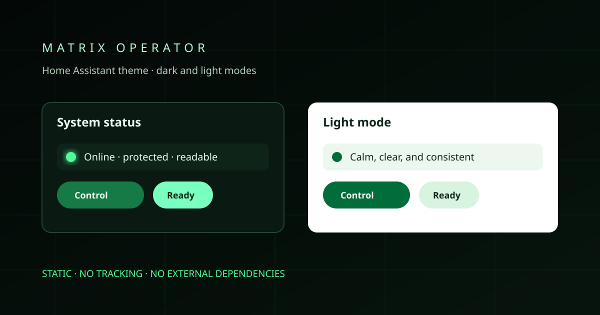

# Matrix Operator

A high-contrast Home Assistant theme with a calm green terminal palette.

Matrix Operator is designed for people who want a distinctive operator-console feel without sacrificing clear text, obvious states, or usable controls on desktop and mobile screens.

> Unofficial fan-made theme. It is not affiliated with or endorsed by the owners of *The Matrix* franchise.

## Highlights

- Dark and light colour modes
- Readable cards, forms, dialogs, sidebars, badges, and native media controls
- Clear active, inactive, warning, error, and unavailable states
- Responsive Home Assistant-native styling with no custom cards or browser animation
- Deliberately static: no digital-rain effect, tracking, external service, or JavaScript

## Install with HACS

1. In HACS, open **Custom repositories**.
2. Add `https://github.com/ArrowSK/matrix-operator-theme`.
3. Select category **Theme**, then download **Matrix Operator**.
4. Reload themes, then choose **Matrix Operator** from your Home Assistant profile.

HACS downloads this repository's theme file to Home Assistant's `themes/` directory. If themes are not already enabled, configure the frontend integration to load that directory.

## Install manually

Copy [`themes/matrix_operator.yaml`](themes/matrix_operator.yaml) to your Home Assistant `themes/` directory, reload themes, and select **Matrix Operator** in your profile.

## Accessibility

The palette is built around dark, light, and accent combinations chosen for legibility. It preserves Home Assistant's normal semantic state colours and uses a dark ink colour on bright notification badges. Third-party cards may define their own styles, so check their contrast separately.

## Privacy

This project contains only generic theme CSS variables. It contains no dashboards, entity IDs, locations, devices, screenshots of a live Home Assistant installation, credentials, or telemetry.

## Contributing

Bug reports and carefully scoped colour or compatibility improvements are welcome. Please remove personal, location, device, entity, and access details from reports and screenshots.

See [CONTRIBUTING.md](CONTRIBUTING.md) and [SECURITY.md](SECURITY.md).

## Licence

Released under the [MIT Licence](LICENSE).
